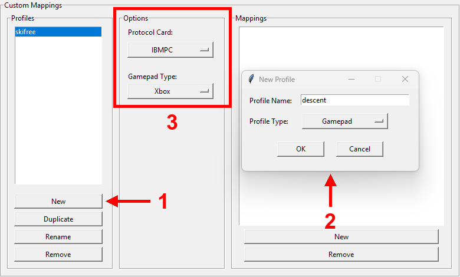
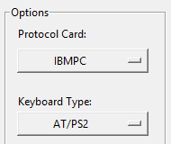
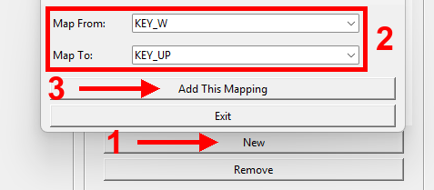

# USB4VC Configurator

[Get USB4VC](https://github.com/dekuNukem/USB4VC/blob/master/README.md) | [Official Discord](https://discord.gg/HAuuh3pAmB) | [Getting Started](https://github.com/dekuNukem/USB4VC/blob/master/getting_started.md)

You can **define your own custom gamepad and keyboard mappings** with USB4VC Configurator. This guide shows you how.

This software is fairly new and experimental right now, so do let me know if you run into any issues!

## Prepare USB Flashdrive

USB4VC Configurator will save all the configuration files into a USB flash drive, so you'll need one of those.

Make sure it is formatted in FAT32:

## Download and Launch the App

[Head here](https://github.com/dekuNukem/usb4vc-configurator/releases/latest) to download the latest release.

Extract the `.zip` file and launch the app by clicking `usb4vc_config.exe`:

## "Untrusted App" Warnings

When trying to run the app, your system might complain about this software being untrusted. This is because I haven't had the code digitally signed, which costs hundreds of dollars a year.

Feel free to [review the code](https://github.com/dekuNukem/usb4vc-configurator/tree/master/src), you can also run `usb4vc_config.py` directly with Python3. 

For Windows 10, click `More info` and then `Run anyway`.

## Using the App

### Select flash drive

Press the `Open...` button and select **the entire flash drive**:

### Make a profile

You can create multiple *profiles* for your USB devices. Each profile contains a different mapping.

Typically you make one for each game / OS.

Click `New` to create a new profile, enter a name, and select the profile type:

* **Gamepad**: For mapping USB gamepad buttons/axes to keyboard, mouse, or 15-pin gamepad outputs
* **Keyboard**: For remapping USB keyboard keys to different keys

Then select the desired protocol card and device-specific options.

## Gamepad Mappings

Select the desired protocol card and USB gamepad type (e.g., Xbox, Playstation, or Generic for unsupported controllers).

### (OPTIONAL) Find out event codes

[Skip this step](#create-a-gamepad-mapping) if you're using a supported controller (i.e. XBox and Playstation).

If you're using an **UNSUPPORTED** gamepad, you might want to find out what each button does first.

Select `Show Event Codes` on main menu:

Press a button on the controller, it will show:

* Device Name

* USB Vendor and Product ID

* Event code name

Write down the **EVENT CODE NAME** for each button, you'll need them later.

**Hold** `+` button while pushing a gamepad button to exit.

### Create a gamepad mapping

Click `New` in `Mappings` section to create a new mapping.

Select the desired combination, and press `Save this Mapping`.

If using unsupported controllers, select the event code name you found out in `Map From` drop-down.

Currently the following combinations are allowed:

USB gamepad **BUTTONS** can be mapped to:

* Keyboard Keys
* Mouse Buttons
* 15-Pin Gamepad Buttons
* 15-Pin Gamepad Half Axes

USB gamepad **AXES** can be mapped to:

* Keyboard Keys
* Mouse Axes
* 15-Pin Gamepad Axes
* 15-Pin Gamepad Half Axes (Xbox analog triggers only)

When mapping **USB gamepad axes to keyboard keys**, make sure to select TWO keys for both direction.

When mapping **analog triggers** to keyboard keys, select the same key.

## Keyboard Mappings

Select the desired protocol card and keyboard type (e.g., AT/PS2, ADB, or Lisa).

### Create Keyboard Mappings

Click `New` in the Mappings section. Select the source key in "Map From" and the target key in "Map To".

For example, you could:
* Remap WASD to arrow keys for games that only support arrows
* Swap Ctrl and Caps Lock positions
* Remap international keyboard layouts
* Map a key to one your keyboard lacks, such as the Power key needed for some vintage Macs

## Save to Flash Drive

After creating your mappings, press `Write Current Mappings to Flash Drive` button:

## Load Mappings on USB4VC

Eject the flash drive and plug it into the USB4VC. Select "Load Custom Config from USB" in the main menu to copy over the mappings.

The new profiles should appear in the `Gamepad Protocol` or `Keyboard` settings depending on the profile type. Use the `enter` button to cycle through.

That's pretty much it! Hopefully it works!

## Problems?

This software is fairly new and experimental right now, and there is no way for me to test every single combination of custom mappings. But of course, do let me know if you run into any issues!

## Questions or Comments?

Feel free to ask in official [Discord Chatroom](https://discord.gg/HAuuh3pAmB), raise a [Github issue](https://github.com/dekuNukem/usb4vc-configurator/issues), [DM on Twitter](https://twitter.com/dekuNukem_), or email `dekunukem` `gmail.com`!
